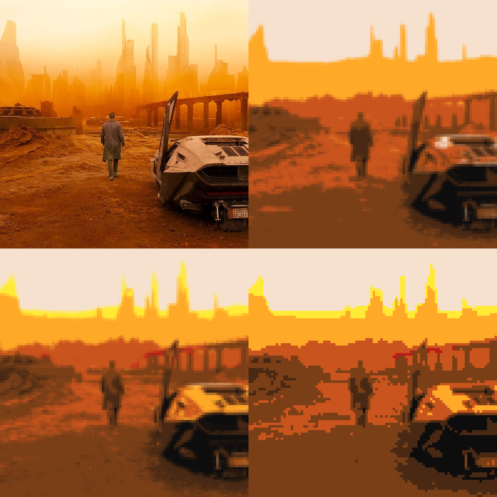
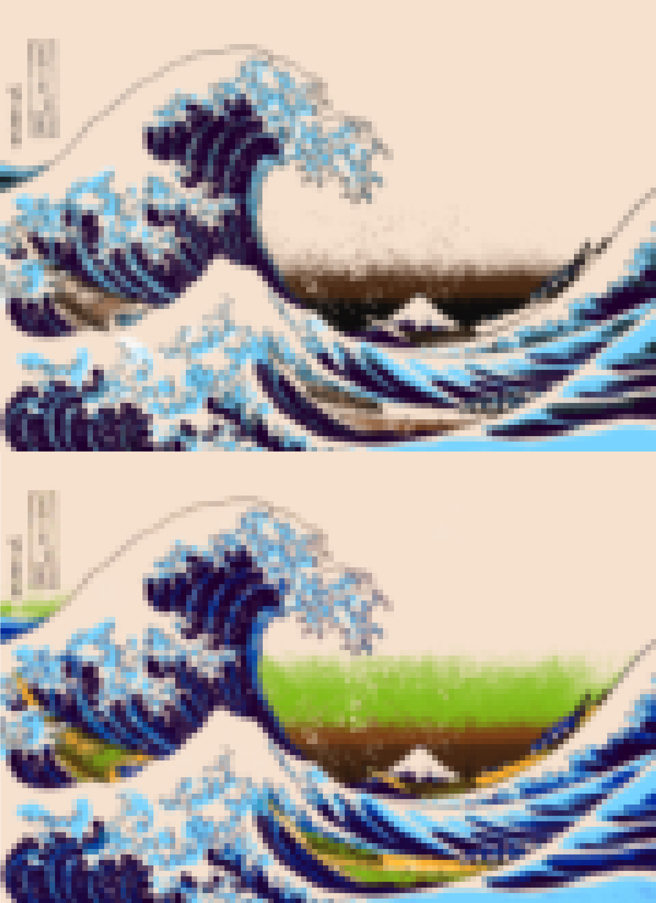
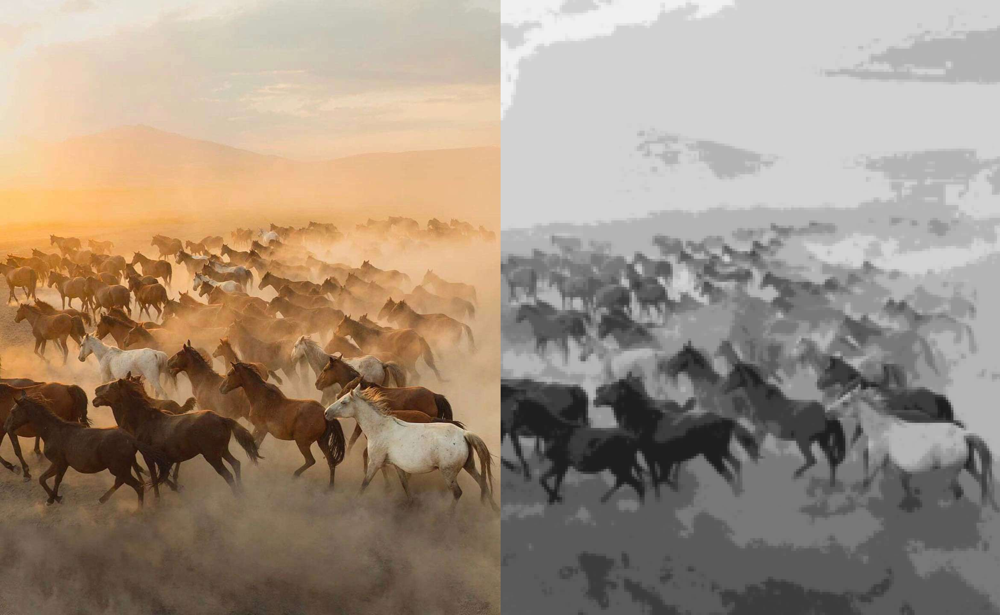
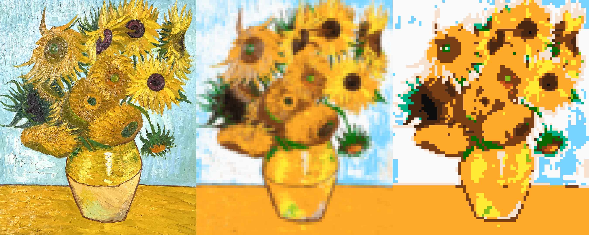
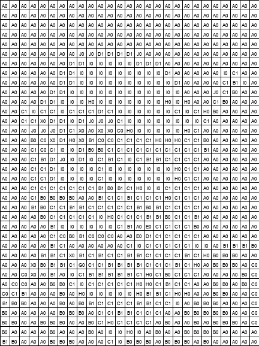
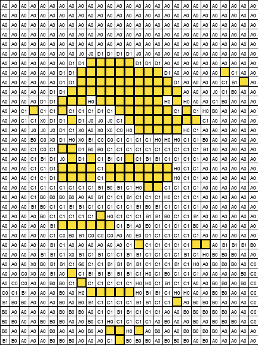

<h1 align="center">
PIXELISER PROJECT
</h1>

<p align="center">
<a href="https://www.python.org">

</a>
</p>

<p align="center">
<a href="#overview">Overview</a> • <a href="#how-to-use">How To Use</a> • <a href="#color-matching-algorithms">Color Matching Algorithms</a> • <a href="#colors-and-default-array">Colors And Default Array</a> • <a href="#quick-render">Quick Render</a> • <a href="#author">Author</a><br>


</p>

---

## Overview

This small project pixelizes and recolors an image according to a specified pixel division and color array.<br>
The project provides a simple yet customizable way to transform images with various options.

## How To Use

### Command Line Options

- `-f` or `--file`: Path to the image file. If not provided, the script launches the file manager for file selection.

- `-p` or `--pixels`: Pixelization degree. Default is set to 16.

- `-c` or `--color_list`: Array of RGB tuples representing colors for recoloring. If not provided, a default color array is used.

- `-v` or `--version`: Recoloring method. Choose between 1 or 2.

- `-q` or `--quick`: Renders a quick version of the image for almost instant display.

- `-i` or `--initial`: Displays both the initial and pixelized images when the code finishes.

- `-l` or `--legend` _(optional param)_: Displays a legend grid showing the color code of each pixel. Each code is represented by a capital letter and a number.<br>

  - Without parameter: shows a blank white grid with codes only.

  - With a color code: fills all cells with the specified code.

- `s` or `--steps`: Displays each legend image sequentially for every color in the image, to replicate the pixelized result step-by-step.

### Example Usage

```bash
$python pixeliser.py -f path/to/image.jpg -p 16 -c "[(255, 0, 0), (0, 255, 0), (0, 0, 255)]" -v 1 -q -i
```

## Color Matching Algorithms

The script recolors each pixel according to the provided color array and then pixelizes the image based on the specified degree (or pixelises and recolors).

The project uses two algorithms version (`--version`) to match colors :

**1.  CIE Lab Color Space**: A perceptually uniform color space is used for accurate color matching.

**2. Euclidean Distance**: A simple distance calculation in RGB space is employed for an alternative matching approach.

### Here's an example with the two different processes:



## Colors And Default Array

If no color array is provided in the options, the default colors are as follows:

|                                                          | RGB                     | HEX         |
| -------------------------------------------------------- | ----------------------- | ----------- |
|  | **rgb(14,13,13)**       | **#0e0d0d** |
|  | **rgb(73,41,20)**       | **#492914** |
|  | **rgb(122,63,23)**      | **#7a3f17** |
|  | **rgb(188,26,26)**      | **#bc1a1a** |
|  | **rgb(202,84,29)**      | **#ca541d** |
|  | **rgb(255,169,40)**     | **#ffa928** |
|  | **rgb(255,235,53)**     | **#ffeb35** |
|  | **rgb(131,188,26)**     | **#83bc1a** |
|  | **rgb(30,167,17)**      | **#1ea711** |
|  | **rgb(9,104,0)**        | **#096800** |
|  | **rgb(1,177,133)**      | **#01b185** |
|  | **rgb(120,212,255)**    | **#78d4ff** |
|  | **rgb(56,97,235)**      | **#3861eb** |
|  | **rgb(1,37,156)**       | **#01259c** |
|  | **rgb(32,0,45)**        | **#20002d** |
|  | **rgb(142,26,188)**     | **#8e1abc** |
|  | **rgb(188,26,166)**     | **#bc1aa6** |
|  | **rgb(255,168,243)**    | **#ffa8f3** |
|  | **rgb(246,225,207)**    | **#f6e1cf** |
|  | **rgb(250,250,250)**    | **#fafafa** |

### Here's an example with a grayscale array provided with `--colors`:



## Quick Render

The `--quick` render option in this script facilitates faster processing by employing a two-step approach: pixelization followed by recoloring (instead of recoloring and then pixelization).

### Here's an example featuring both a classic and a quick render:



## Legend Mode

The `--legend` mode  creates a reference grid to manually recreate the pixelized image.

- Without parameter: shows a white grid with each pixel’s color code.

- With a code parameter: all grid cells are colored with the given code.

 

## Steps Mode

The `--steps` mode outputs each color layer of the pixelized image as a separate legend grid, in sequence.
This is useful for **manual pixel art reproduction**.

## Author

- [Gelles Julien](https://www.github.com/julien-gelles)


